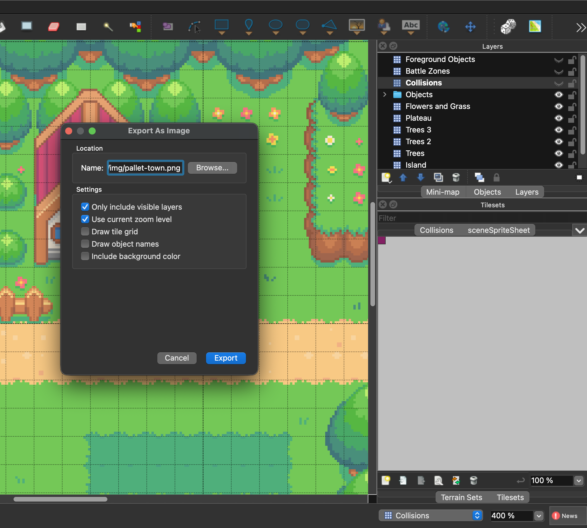

# Canvas with React

Try game development in HTML Canvas

https://www.youtube.com/watch?v=yP5DKzriqXA

## Tiled Map Editor

1. https://www.mapeditor.org/
2. https://thorbjorn.itch.io/tiled

### Assets

https://itch.io

## Development

```bash
pnpm dev
```

## Getting Started

You must have **Tiled** installed if you want to modify the map. Otherwise,
the assets are already created at [src/assets/tiled](./src/assets/tiled/)

- `.tmx` = Tilemap
- `.tsx` = Tileset

### Tiled (Optional)

Note the `pallet-town.tmx` has **70x40** tiles. And each tile has a size of 12x12 pixel.

#### Create the main map/background

1. With **Tiled**, open project `src/assets/tiled/pallet-town.tmx`
2. Hide the following layers: **Foreground Objects**, **Battle Zones**, **Collisions**
3. In bottom-right of **Tiled**, change the zoom to `400%`
4. **Tiled** > **File** > **Export As Image...**



> Saved to [`src/assets/img/pallet-town.png`](./src/assets/img/pallet-town.png)

#### Create the main map/foreground

1. Using the same `pallet-town.tmx`
2. Hide all layers except **Foreground Objects**
3. In bottom-right of **Tiled**, change the zoom to `400%`
4. **Tiled** > **File** > **Export As Image...**

> Saved to [`src/assets/img/pallet-town-foreground.png`](./src/assets/img/pallet-town-foreground.png)

#### Extract the collision data

1. Using the same `pallet-town.tmx`
2. **Tiled** > **File** > **Export As...**
3. Save as [`pallet-town.json`](./src/assets/tiled/pallet-town.json)
4. Copy the data array which you will be needing for [`collisions.ts`](./src/features/collisions.ts)

### Game State and other features

See first [`game-state.ts`](./src/features/game-state.ts) - holds the game state and image assets

## Zero to Hero

See [`docs/zero-to-hero.md`](./docs/zero-to-hero.md) for a step-by-step walkthrough of the
actual game-dev mechanics: the game loop, sprites & animation, input handling, Tiled
collision, and the camera trick — with links straight into the real source files.
